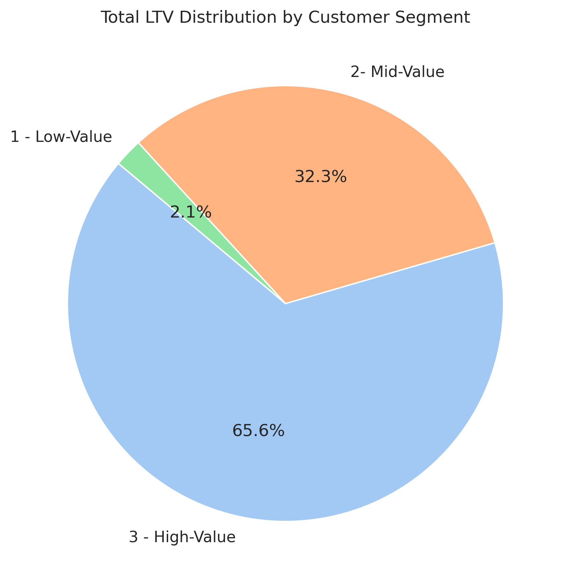
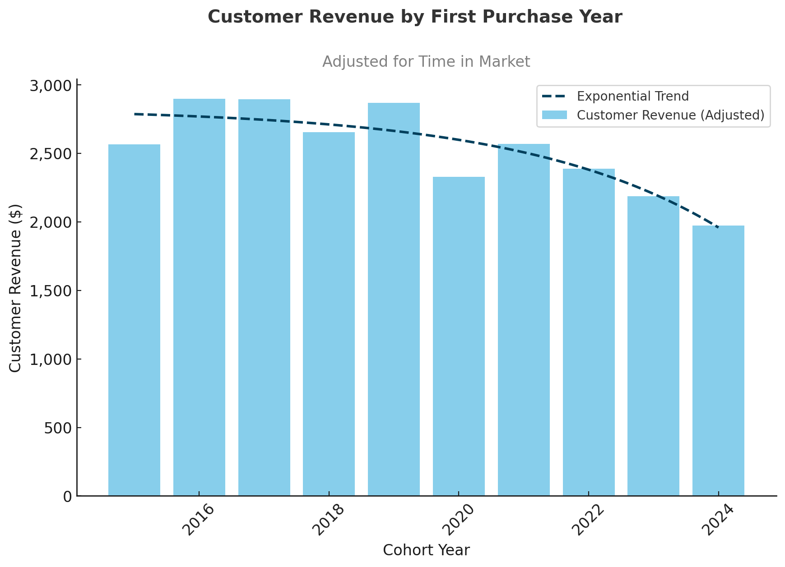
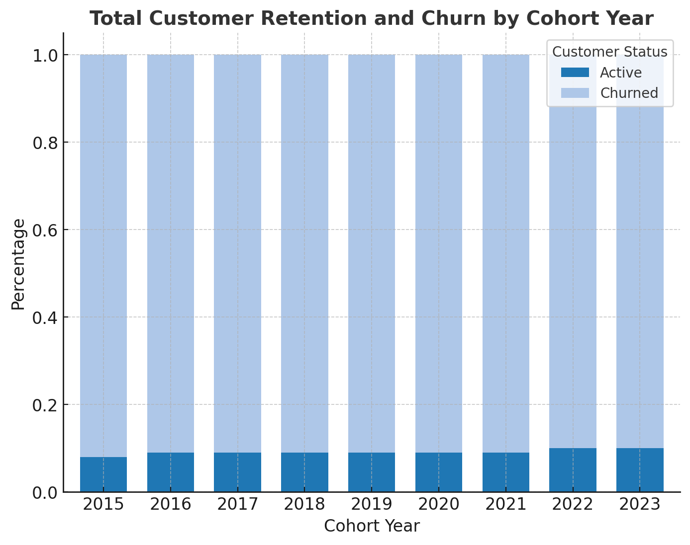

# Sales Optimization Analysis

## Overview  
This analysis explores customer behavior, retention trends, and lifetime value (LTV) within an e-commerce business. The goal is to uncover actionable insights to boost customer retention and maximize long-term revenue.

## Business Questions  
1. **Customer Segmentation:** Who are our most valuable customers?  
2. **Cohort Analysis:** How does customer value evolve across different cohorts?  
3. **Retention Analysis:** Which customers are at risk of churning?

## Analysis Approach

### 1. Customer Segmentation Analysis  
- Customers were grouped based on their total lifetime value.  
- Segments were defined as High, Mid, and Low-value tiers.  
- Core performance metrics such as total revenue were calculated for each group.

**SEE QUERY** : [customer_segmentation.sql](/Scripts/1-customer_segmentation.sql)

**📈 Visualization:**  

**Key Insights:**  
- **High-value customers** (top 25%) generate **66%** of total revenue (~$135.4M).  
- **Mid-value customers** (50%) contribute **32%** (~$66.6M).  
- **Low-value customers** (bottom 25%) account for just **2%** (~$4.3M).

**💡 Strategic Takeaways:**  
- **High-Value Segment (66% revenue):** Introduce a premium loyalty or VIP program targeting the top 12,372 customers. Retaining just a few of them can have a major revenue impact.  
- **Mid-Value Segment (32% revenue):** Focus on upselling through tailored promotions and offers—this segment has strong growth potential.  
- **Low-Value Segment (2% revenue):** Re-engagement strategies and price-sensitive offers may help increase their purchase frequency.

---

### 2. Cohort Analysis  
- Customers were grouped into cohorts based on the year of their first purchase.  
- Revenue and active users were tracked over time to analyze behavioral trends.

**SEE QUERY** : [cohort_analysis.sql](/Scripts/cohort%20view%20Script.sql)

**📈 Visualization:**  

**Key Insights:**  
- Revenue per customer is on a downward trend across newer cohorts.  
- Cohorts from 2022 to 2024 show consistently lower performance compared to earlier groups.  
- The overall increase in revenue appears to be driven by a larger customer base, not individual value.

**💡 Strategic Takeaways:**  
- Customer value is declining—this needs immediate attention.  
- The drop in customer acquisition in 2023 raises red flags.  
- With both LTV and acquisition falling, the business faces a risk of long-term revenue stagnation or decline.

---

### 3. Customer Retention  
- Identified customers at risk based on last purchase date and cohort trends.  
- Analyzed customer-specific behavior to assess churn probability.

**SEE QUERY** : [3-customer_retention.sql](/Scripts/3-retention_analysis.sql)

**📈 Visualization:**  

**Key Insights:**  
- Churn stabilizes around **90%** after 2–3 years across all cohorts.  
- Long-term retention remains low (~8–10%), signaling a systemic issue.  
- Newer cohorts (2022–2023) mirror the same drop-off pattern, suggesting future customers may follow suit unless action is taken.

**💡 Strategic Takeaways:**  
- Strengthen early-stage engagement with onboarding programs, loyalty rewards, and personalized communication.  
- Reactivate high-value churned users with targeted win-back initiatives—these yield higher ROI than broad-based campaigns.  
- Develop churn prediction models and intervene proactively when signs of disengagement appear.

---

## Strategic Recommendations

### 1. Customer Value Optimization (Segmentation)  
- Launch a VIP program for the top 12,372 high-value customers (66% of revenue).  
- Drive upgrades from mid-value customers using personalized journeys (potential to grow $66.6M → $135.4M).  
- Reignite interest from low-value customers with budget-conscious promotions and engagement hooks.

### 2. Cohort Performance Strategy (Cohort Revenue)  
- Re-engage 2022–2024 cohorts with customized offers and campaigns.  
- Introduce subscription or loyalty-based models to smooth revenue volatility.  
- Adapt successful engagement strategies used for 2016–2018 cohorts to current customers.

### 3. Retention & Churn Prevention  
- Focus efforts on the critical first 1–2 years of customer activity.  
- Prioritize retention of high-value churned customers using focused campaigns.  
- Implement real-time churn risk monitoring and proactive intervention systems.

---

## Technical Details  
- **Database:** PostgreSQL  
- **Tools Used:** PostgreSQL, DBeaver, PGAdmin  
- **Visualization:** ChatGPT
